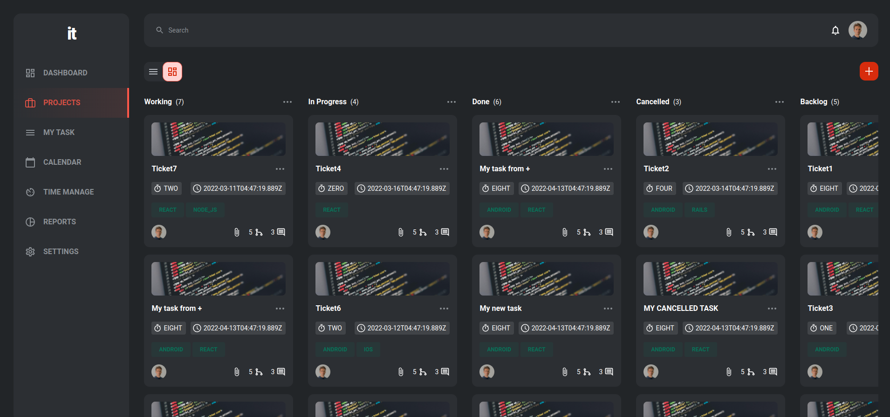

<div align="center">
<h1><a href="https://music-candy.netlify.app/" target="_blank">IT T4SKS</a></h1>
</div>

<div align="center">
  
  
  
  
  
  
  
</div>

<p align="center">A web single page app to manage projects through specific goals set by project.</p>

<br>

<div align="center">
</div>

### Features:

- Fetch list of tasks from Apollo database
- Create new tasks to the database
- Mantain important data fetched in state
- Update data from tasks after mutations

### Live Demo

- Deployed to Netlify: [Live Demo](https://t4sks-ravn.netlify.app/)

### Built With

- HTML, CSS, JavaScript
- React
- NextJS
- React Query
- GraphQL Request
- TailwindCSS

## Getting Started

## Development

First, run the development server:

```bash
npm run dev
# or
yarn dev
```

Open [http://localhost:3000](http://localhost:3000) with your browser to see the result.

### Bundle project

- `npm run build`

### Linters

- `npm run lint`

## Learn More

To learn more about Next.js, take a look at the following resources:

- [Next.js Documentation](https://nextjs.org/docs) - learn about Next.js features and API.
- [Learn Next.js](https://nextjs.org/learn) - an interactive Next.js tutorial.

## Author

👤 **Daniel Jaramillo**

- GitHub: [@d4nielj](https://github.com/d4nielj)
- Twitter: [@d4niel_jm](https://twitter.com/d4niel_jm)
- LinkedIn: [d4nielj](https://linkedin.com/in/d4nielj)

## 🤝 Contributing

Contributions, issues, and feature requests are welcome!

Feel free to check the [issues page](../../issues/).

## Show your support

Give a ⭐️ if you like this project!

## 📝 License

This project is [MIT](./LICENSE) licensed.

This is a [Next.js](https://nextjs.org/) project bootstrapped with [`create-next-app`](https://github.com/vercel/next.js/tree/canary/packages/create-next-app).
